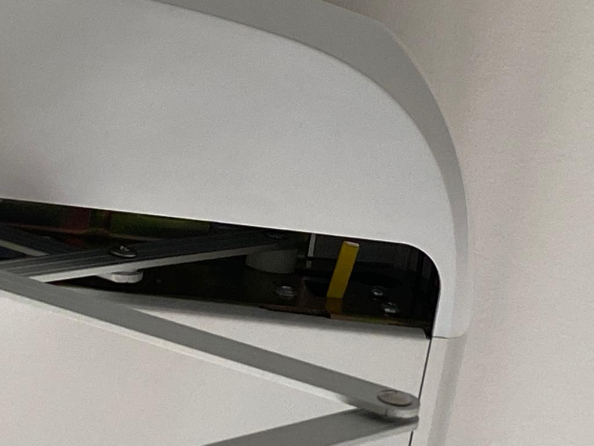

<!--
  SPDX-FileCopyrightText: 2021 The Open Steigen Authors
  SPDX-License-Identifier: CC-BY-SA-4.0
-->

# Data Points

A data point (DP) "is the abstract representation of function, and each function can be defined by different function types. Six data types are available now, namely Boolean, Integer, Enum, Fault, Char type and RAW type." <sup>[1]</sup> Data points are represented as key-value pairs, where the key is a numerical _data point ID_ (DPID). Some data points are returned by the Steigen appliance ("only report"), can be sent to the appliance ("only issue"), or both ("issue and report"); This is known as the DP _data transfer type_ <sup>[1]</sup>.

## Documented Data Points

These are rough notes from yours truly. We may need to tidy it up, but it'll do for now.

`valid-when` is a guideline used to decide when the DP's value is considered accurate, as some of these values may output weird or misleading values outside of the documented circumstances.

> **Note:** This only documents DPs that are returned by the appliance; "Hidden", write-only DPs have not been tested.

> **Note:** The following has only been tested against the "Solar" variant; Hence additional DPs for dustmite repeller and the ionizer are not documented.

```
dps
  2
    enum: 'up' | 'down' | 'stop'
    permissions: READ, WRITE
    for: Current vertical movement of rack.
    notes:
      - Safety stop will trigger 'stop'.
      - Full extension or retraction will trigger 'stop'
      - Sending the same value as the current value (i.e. 'up' while it's already going up) which trigger 'stop'
  4
    enum: true | false
    permissions: READ, WRITE
    for: Light switch
  6
    enum: true | false
    permissions: READ, WRITE
    for: Fan switch
    notes:
      - Heater turning off will trigger fan to true for a few seconds.
  7
    enum: true | false
    permissions: READ, WRITE
    for: Heater switch
  15
    enum: 0 | 180
    permissions: READ ONLY
    for: Heater timer
    valid-when: dp 7 is true
    notes:
      - Heater turning on will trigger this to '180'.
  16
    enum: 0 | 1 | 180
    permissions: READ ONLY
    for: Fan Timer
    valid-when: dp 6 is true
    notes:
      - Heater turning off will trigger this to '1'
      - Fan turning on after heater will trigger this to '0'
      - Fan turning off after heater will trigger this to '180'
      - Fan turning on manually will trigger this to '180'
      - Fan turning off manually MAY NOT trigger this.
  18
    enum: 0 | 2 (obstacle detected)
    permissions: READ ONLY
    for: Rack Vertical Obstacle Deteciton
    notes:
      - Works even if paused anywhere
      - Most probably detected by the load on the motor.
      - When dp 18 = 2, dp 2 cannot be set.
      - When dp 2 = 'down' and obstacle is detected, dp 2 = 'up' and dp 18 = 2, then dp 2 = 'stop' and  dp 18 = 0
      - When dp 2 = 'up' and obstacle is detected, dp 2 = 'stop' and normal dp 18 sequence (2 then 0) executes.
      - When dp 2 = 'stop' and obstacle is detected, normal dp 18 sequence (2 then 0) executes.
  101
    enum: 'top' | 'centre' | 'bottom'
    for: Current vertical position of rack.
    valid-when: 
    notes:
      - Likes to default to 'centre' even if it's all the way to the top.
      - 'top' is detected by a golden-brown lever inside on of the rack cavities.
      - 'bottom' is most probably detected by the motor.
      - When raised to the top, refresh value becomes 'top'. However, re-initializing socket will cause data and refresh value to be 'centre'.
      - When raised to the top when already at the top (irregardless of report value), no refres value is sent (i.e. remains 'centre').
```

## FAQ

### What happens when I write to a read-only ("only report") data point?

Nothing. Though trying to write to timer data points (i.e. DPID 15, 16) may cause the appliance to send "refresh data" of those data points.

### Why does Data Point ID 101 return "centre" even though it's at the top?

Idk. DPID 101 is set to "top" by a small, golden/yellow-ish lever inside one of the rack cavities.



This value may be accurate after receiving a refresh data of "top". However, re-connecting to the appliance will cause the value to reset to "centre". Hence, the value should only be considered accurate after the appliance is raised during the current network socket session.

### Can the heater or fan timer duration be changed?

No. They are read-only DPs, and we've tried.

A running theory is that selecting the 1-hr or 2-hr timer on the mobile app just triggers the normal 3-hr timer, and the Tuya Smart cloud platform sends a manual "off" command to the Steigen appliance. This would explain why it's not possible to set a timer longer than 3 hours.

### Can I set a timer longer than 3 hours?

Somewhat yes. Sending 2 consecutive commands to toggle the heater/fan off and on (no arbitrary delay needed) will cause the timer to reset. However, there isn't a documented way to change the timer duration itself.

## References

[1] https://developer.tuya.com/en/docs/iot/configure-in-platform/function-definition/custom-functions?id=K937y38137c64